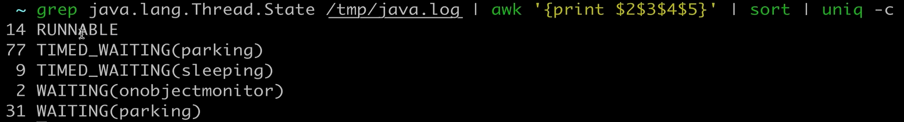
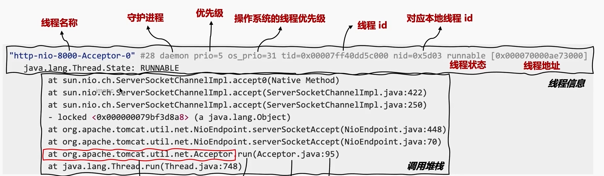

线程堆栈

> 命令： 
> grep java.lang.Thread.State 堆栈文件 | awk '{print $2$3$4$5}' | sort | uniq -c  
> 解释： 
> grep java.lang.Thread.State 堆栈文件 扫描出堆栈文件中带有线程状态的所有行  
> awk '{print $2$3$4$5}' 计算每一个状态有多少个案例; $2$3$4$5 表示打印每行的第2、3、4、5个字段 
> sort | uniq -c 排序, uniq -c 计算线程不同状态; -c 选项表示在去除重复行的同时,显示每行出现的次数

举例如下：

先分析堆栈的状态和对应的数量，然后在堆栈文件中找对应状态的线程栈进行堆栈分析，看是哪一行代码出现问题
 
线程堆栈 通过jsp 和 jstack pid 导出堆栈 线程状态

